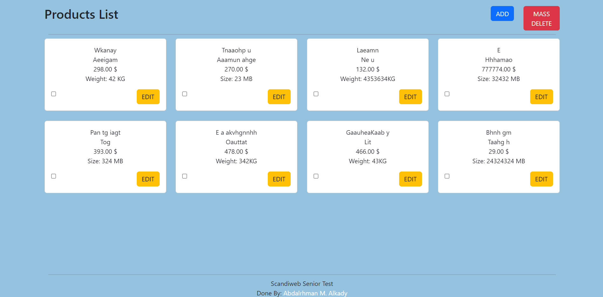

# Home Page

<figure><figcaption>
Home Page
</figcaption></figure>

Main Functionalities:

1. List All Products from Database.
2. Access add and edit page from its buttons.
3. Delete Selected projects with MASS DELETE Button
   * Delete Products Request go through validation first to filter the input from any malicious script.
   * then Delete Products Request go through validation to check if these product exist  in database or not.
   * if there is any error with validation redirect back to home page and list errors else redirect with success message.
